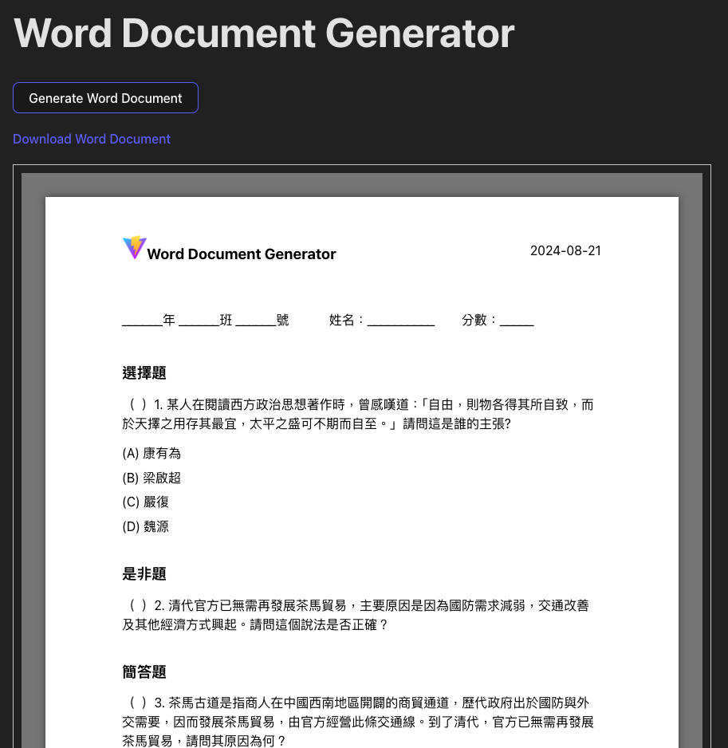

# Word Document Generator with React and docx-preview

This project is a React-based application for generating and previewing Word documents dynamically using the `docx` library and `docx-preview`. It includes support for adding images, styled text, tables, and headers, and generates A4-sized Word documents with multiple sections.

## Features

- **Dynamic Word Document Creation**:
  - Create professional-looking Word documents with custom headers, tables, and paragraphs.
  - Supports styled text (bold, italic, colors) and flexible alignment.

- **Image Integration**:
  - Dynamically add images from the local file system or public assets folder.
  - Maintains the aspect ratio of images when resizing.

- **Document Preview**:
  - Preview the generated document directly in the browser using `docx-preview`.
  - Supports downloading the document as a `.docx` file.

- **Prebuilt Structure**:
  - Includes headers with logos, dates, and text alignment.
  - Multiple sections for questions, answers, and detailed explanations.

## Technologies Used

- **React**: Frontend framework for building the application UI.
- **docx**: JavaScript library for generating Word documents programmatically.
- **docx-preview**: Library for rendering Word documents in the browser.
- **Vite**: Fast build tool for development and bundling.

## Installation

1. Clone this repository:

   ```bash
   git clone https://github.com/your-repository/word-document-generator.git
   cd word-document-generator
   ```

2.	Install dependencies and Start the development server

    ```bash
    npm install
    npm run dev
    ```

3.	Open your browser and navigate to the development server URL (e.g., http://localhost:3000).


## Usage

1. **Preview the Document**:
   - Click the **"Generate Word Document"** button to dynamically generate and render a Word document preview.
   - The document preview will appear in the designated preview area on the page.

2. **Download the Document**:
   - After generating the document, a download link will appear below the preview area.
   - Click the link to download the generated `.docx` file.

---

## Key Functionality

### `fetchImageAsBase64`

- Converts an image from a URL into a Base64-encoded string.
- Used to dynamically add images into the Word document while maintaining the aspect ratio.

### `createWordDocument`

- Generates a Word document with the following structure:
  - **Header**: Includes the logo image, title ("Word Document Generator"), and date.
  - **Body**: Multiple sections with styled text and questions.
  - **Answers Section**: Explanation of the questions and their answers.

### `useEffect`

- Loads the Base64-encoded image on component mount, ensuring that the image is ready when the document is created.


## Demo

